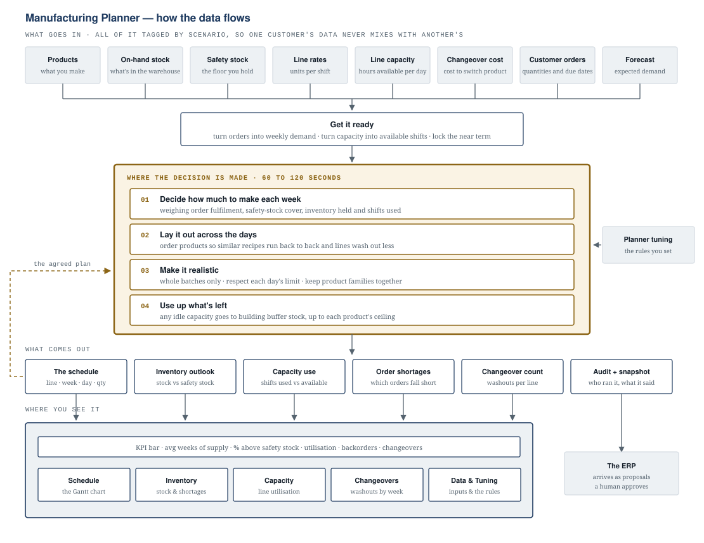

# Manufacturing Planner — data flow

A production planning system for batch manufacturing, drawn end to end: what data
goes in, where the decision gets made, and where each result appears on screen.

**▶ [View the full interactive page](https://srkale12.github.io/Planner_for_Manufacturing/)**



## What the system does

A factory makes hundreds of products on a handful of production lines. Every
week somebody decides what to make, on which line, on which day, and how much —
balancing order fulfilment against inventory investment against changeover time.
This is the system that makes that decision.

- Builds a twelve-week plan across multiple production lines in about 90 seconds
- Weighs four competing goals at once: filling customer orders, holding safety
  stock, avoiding excess inventory, and using shifts efficiently
- Sequences production day by day so compatible products run together and lines
  spend less time being washed out between runs
- Python / FastAPI backend, React frontend, SQL data layer
- Ships three ways from one codebase: hosted web app, Windows desktop installer,
  and an ERP connector

It recommends; it never writes to a system of record. A planner reviews every
proposal, the ERP creates the actual production orders, and every recommendation
is logged with who ran it and what it said.

## Reading the diagram

| Zone | What it shows |
|---|---|
| **Top** | Eight data sources, all in one database, each row tagged with a `scenario` label so two customers — or one planner running what-ifs — never see each other's numbers |
| **Middle** | The only place a decision is made. Everything above it is preparation; everything below it is presentation |
| **Bottom** | Six sets of results fanning out to five screens plus the KPI bar. One of them, the audit snapshot, goes to the ERP as a proposal rather than to a screen |

The dashed line on the left is what makes this an operating process rather than a
one-off calculation: once a planner accepts a plan, it becomes the anchor the
next run is measured against, so re-planning reads as an adjustment instead of a
rewrite.

## This repository

The explainer page only — one self-contained HTML file, no build step, no
dependencies, no external requests. The planner source is not public.

```
index.html     the full page
diagram.svg    the data-flow diagram, standalone
preview.png    link-preview image (optional; see below)
```

## Link previews

`index.html` carries Open Graph tags so the page renders as a card when shared.
Two values must be absolute URLs pointing at the live site — update them if the
repository name or account changes:

- `og:url`
- `og:image` → expects `preview.png` (1200×630) in this folder

Figures shown in the example walkthrough are illustrative, not production data.
